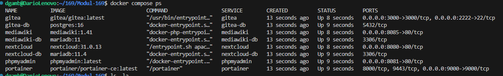
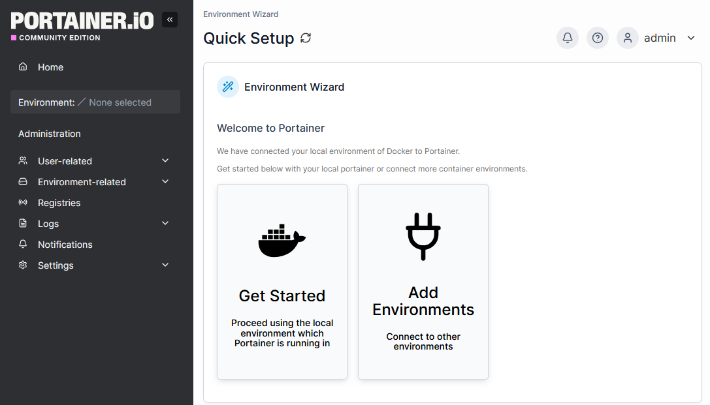
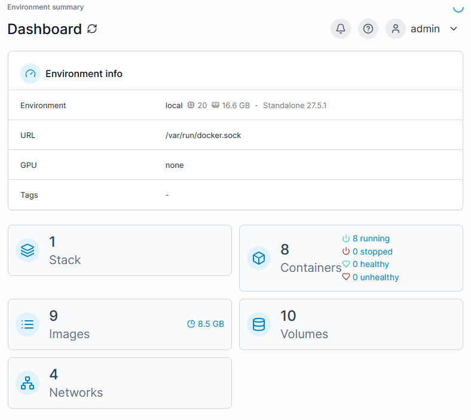
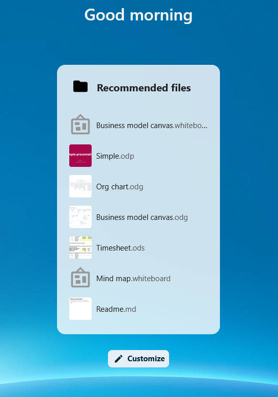
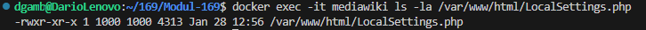
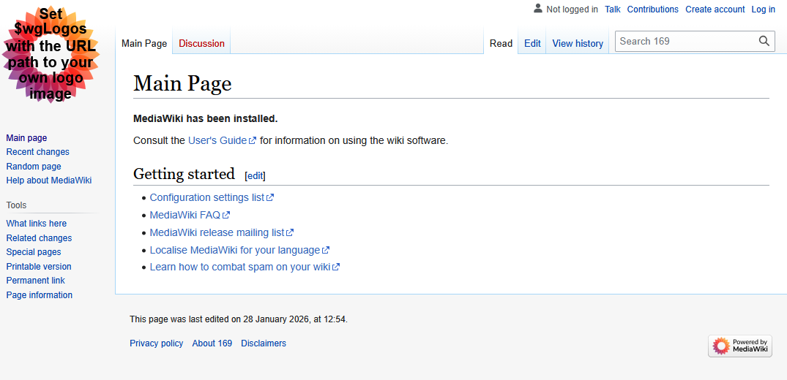
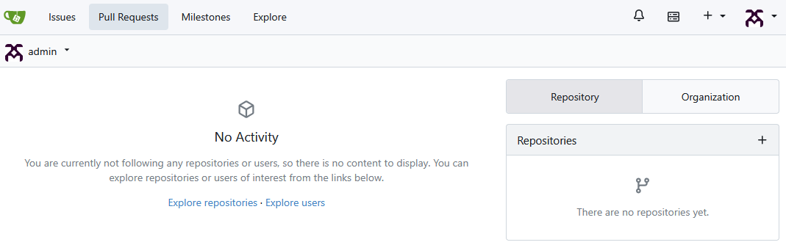

## 09.01.2026 - Initialisierung des Git-Repository

### Initialisierung es Git-Repository

**Beschreibung:** 

Das Projekt wurde initialisiert.
Das erste Skelett der Ordnerstruktur wurde erstellt.
- docker_compose.yml
- .gitignore
- .env.example
- README.md
- Ordner "dokumente"
  - arbeitsjournal.md
  - arbeitsplan.md
  - sicherheitskonzept.md
  - tests.md

## 16.01.2026 - Initialisierung Container und Erstkonfiguration

### Arbeitschritt: Initialisierung Container und Erstkonfiguration

**Beschreibung:**

- Docker-Compose file erfolgreich gestartet
- Nextcloud, Mediawiki und Gitea initial konfiguriert
- Persitent der Daten durch Volumes getestet (Neustart war erfolgreich)
- Container werden über Portainer überwacht

## 23.01.2026 - Docker Compose File neu erstellt

### Docker Compose File neu erstellt

**Beschreibung:**

- Docker Compose mit den neuen erlertnet Memory Limit bearbeitet 
- Diverse Optimierungen 

## 24.01.2026 - Docker Compose finalisiert

### Docker Compose file wurde erneut verbessert

**Beschreibung:**

## 28.01.2026 - Docker Compose ausführen und aufsetzen / Testfälle definieren und dokumentieren

### Start der Docker Infrastruktur

**Beschreibung:**

- Die für die Docker-Bind-Mounts benötigten Verzeichnisse wurden bewusst manuell erstellt.
  Dadurch wird sichergestellt, dass Docker keine Ordner mit falschen Besitzrechten anlegt.
  Die Ordner selbst gehören zur Infrastruktur, deren Inhalte jedoch zu den Laufzeitdaten der Dienste und werden deshalb nicht versioniert.

  - mkdir -p ../nextcloud/nextcloud_db_data ../nextcloud/nextcloud_data ../nextcloud/config 
  - mkdir -p ../gitea/gitea_db_data ../gitea/gitea_data
  - mkdir -p ../mediawiki/mediawiki_db_data
  - mkdir -p ../portainer/portainer_data

Die vorbereiteten Docker-Container wurden mittels docker compose up -d gestartet.
Anschliessend wurde der Status aller Container überprüft, um sicherzustellen, dass sämtliche Dienste korrekt laufen.
Alle Applikations- und Datenbankcontainer befanden sich im Status running.

docker ps gibt foglendes aus:  

### Einrichtung Portainer

**Beschreibung:**

Zur Überwachung der laufenden Container wurde Portainer eingerichtet.
Nach dem Start wurde ein Administratorkonto erstellt und das lokale Docker-Environment eingebunden.
Dadurch konnten Status und Ressourcenverbrauch der Container zentral überwacht werden.
Bei der Erstinstallation von Portainer wurde ein Administratorkonto erstellt.
Die Zugangsdaten wurden unabhängig von den Infrastruktur-Variablen definiert, da Portainer seine Benutzerverwaltung intern vornimmt.

Das lokale Docker Environment wurde eingebuten und überorüft ob alle Container korrekt laufen:

### Installation und Erstkonfiguration von Nextcloud

**Beschreibung:**

Nextcloud wurde über die Weboberfläche installiert.
Dabei wurde ein Administratorkonto erstellt und die Verbindung zur MariaDB-Datenbank konfiguriert.
Nach Abschluss der Installation konnte die Nextcloud-Weboberfläche erfolgreich aufgerufen werden.

### Testfälle zu Nextcloud dokumentiert

**Beschreibung:** 

Folgende Testfälle wurden durchgeführt und in tests.md dokumentiert:
- Nextcloud Web-UI erreichbar (Port 8080) 
- Datei erstellen & speichern 
- Persistenz nach Neustart

### Installation MediaWiki

**Beschreibung:**
MediaWiki wurde über den Webinstaller (http://localhost:8085) eingerichtet und mit einer MariaDB-Datenbank verbunden.
Die Konfigurationsdatei LocalSettings.php sowie der Upload-Ordner wurden persistent eingebunden.

Die MediaWiki-Konfigurationsdatei LocalSettings.php wurde persistent mittels Bind-Mount in den Container eingebunden.
Die korrekte Einbindung der Volumes wurde anschliessend mit dem Befehl docker inspect überprüft.

Nach der erstmaligen Ausführung von docker compose up ist zu beachten, dass Docker Compose relative Volume-Pfadangaben in absolute Host-Pfade auflöst. Diese effektiven Pfade werden intern verwendet und sind im docker inspect sichtbar.
Änderungen an Volume-Definitionen erfordern daher das vollständige Entfernen und Neuerstellen des Containers mittels docker compose down und docker compose up -d, da bestehende Container ihre Volume-Konfiguration nicht dynamisch übernehmen.

    volumes:
      - /home/dgamb/169/mediawiki/mediawiki_images:/var/www/html/images
      - /home/dgamb/169/mediawiki/LocalSettings.php:/var/www/html/LocalSettings.php
      

### Gitea

**Beschreibung:**

Das Code-Versionierungssystem Gitea wurde mit einer PostgreSQL-Datenbank installiert und initial konfiguriert. Ein Administrator-Konto wurde erstellt und das Webinterface erfolgreich in Betrieb genommen.

  