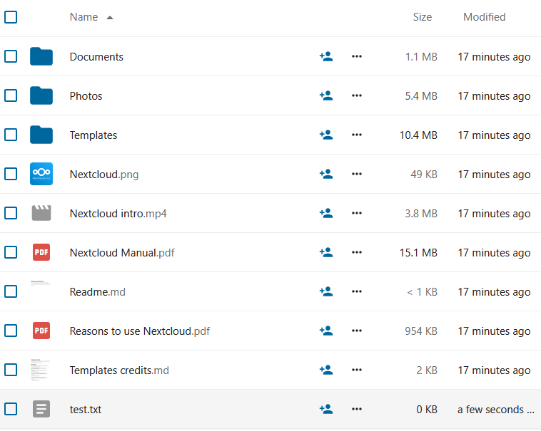
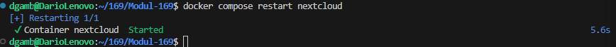
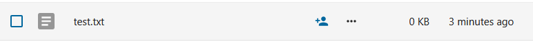
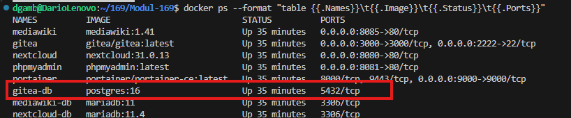
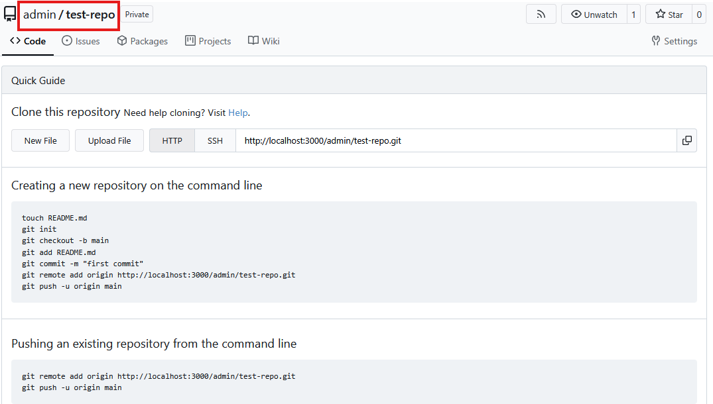

# Testfälle – Nextcloud

## Testfall NC-1: Erreichbarkeit der Weboberfläche

**Datum:** 28.01.2026

**Tester:** Dario Gambone

**Ziel:**  
Überprüfung, ob die Nextcloud-Weboberfläche über den vorgesehenen Port erreichbar ist.

**Voraussetzungen:**  
- Docker-Infrastruktur ist gestartet  
- Nextcloud-Container läuft

**Testschritte:**  
1. Webbrowser öffnen  
2. URL `http://localhost:8080` aufrufen  

**Erwartetes Resultat:**  
- Die Nextcloud-Weboberfläche wird angezeigt  

**Testergebnis:**  
OK

**Beweis:**  

# Testfall NC-2: Datei erstellen und speichern

**Datum:** 28.01.2026

**Tester:** Dario Gambone

**Ziel:**  
Überprüfung der Dateiablage und Speicherfunktion von Nextcloud.

**Voraussetzungen:**  
- Anmeldung als Administrator in Nextcloud  
- Weboberfläche erreichbar

**Testschritte:**  
1. Anmeldung als Admin-Benutzer  
2. Wechsel zum Menüpunkt Files
3. Neue Datei erstellen "test.txt"

**Erwartetes Resultat:**  
- Die Datei wird erfolgreich erstellt 
- Die Datei ist in der Dateiliste sichtbar  

**Testergebnis:**  
OK  

**Beweis:**  

# Testfall NC-3: Persistenz nach Container-Neustart

**Datum:** 28.01.2026

**Tester:** Dario Gambone

**Ziel:**  
Überprüfung, ob Daten nach einem Neustart der Container weiterhin vorhanden sind.

**Voraussetzungen:**  
- Testfall NC-2 erfolgreich durchgeführt  
- Datei ist in Nextcloud vorhanden

**Testschritte:**  
1. Docker-Container neu starten (`docker compose restart nextcloud`)  
2. Nach dem Neustart Anmeldung in Nextcloud  
3. Wechsel zum Menüpunkt Files

**Erwartetes Resultat:**  
- Die zuvor erstellte Datei ist weiterhin vorhanden  

**Testergebnis:**  
OK

**Beweis:**  

# Testfälle - Gitea / CVS

## Testfall CVS-1: Web-UI erreichbar (Port 3000)

**Datum:** 28.01.2026

**Tester:** Dario Gambone

**Ziel:**  
Überprüfung, ob die Gitea-Weboberfläche über den vorgesehenen Port erreichbar ist.

**Voraussetzungen:**  
- Docker-Stack läuft (`docker compose up -d`)  
- Container `gitea` ist Up

**Testschritte:**  
1. Webbrowser öffnen  
2. URL `http://localhost:3000` aufrufen  
3. Prüfen, ob die Gitea-Startseite/Dashboard angezeigt wird

**Erwartetes Resultat:**  
- Die Gitea-Weboberfläche lädt ohne Fehler  
- Login-Maske oder Dashboard ist sichtbar

**Testergebnis:**  
OK  

**Beweis:**  

## Testfall CVS-2: Repository erstellen

**Datum:** 28.01.2026

**Tester:** Dario Gambone

**Ziel:**  
Überprüfung, ob ein neues Repository über die Weboberfläche erstellt werden kann.

**Voraussetzungen:**  
- Admin-Login in Gitea 
- Gitea-Weboberfläche erreichbar

**Testschritte:**  
1. In Gitea einloggen  
2. Auf "New Repository" klicken  
3. Repository-Name setzen, `test-repo`  
4. Sichtbarkeit: Private oder Public
5. Repository erstellen

**Erwartetes Resultat:**  
- Repository wird erstellt  
- Repository erscheint in der Übersicht  
- Repository-Seite ist aufrufbar 

**Testergebnis:**  
OK  

**Beweis:**  

## Testfall CVS-3: Commit & Versionshistorie (Web oder Git)

**Datum:** 28.01.2026

**Tester:** Dario Gambone

**Ziel:**  
Überprüfung, ob Änderungen versioniert werden können und in der Historie sichtbar sind.

**Voraussetzungen:**  
- Repository existiert (z. B. aus Testfall CVS-2)  
- Login in Gitea

**Testschritte (Variante A – Web):**  
1. Repository öffnen  
2. Datei erstellen über Web-UI (z. B. `test.txt`)  
3. Commit Message eingeben (z. B. `Add test file`)  
4. Commit bestätigen  
5. Reiter **Commits** öffnen

**Erwartetes Resultat (Variante A):**  
- Commit wird erstellt  
- Commit erscheint in der Commit-Historie  
- Datei ist im Repository sichtbar

**Testschritte (Variante B – Git über CLI):**  
1. Repo via SSH klonen (Beispiel):  
   `git clone ssh://git@localhost:2222/<USER>/test-repo.git`  
2. Datei anlegen/ändern (z. B. `test.txt`)  
3. Commit ausführen:  
   `git add .`  
   `git commit -m "Add test file"`  
4. Push ausführen:  
   `git push`

**Erwartetes Resultat (Variante B):**  
- Push erfolgreich  
- Commit erscheint in Gitea unter **Commits**

**Testergebnis:**  
☐ OK  ☐ Nicht OK

**Beweis:**  
- Screenshot der **Commits**-Ansicht mit dem neuen Commit  
- (optional) Terminal-Ausgabe von `git push` als Screenshot
